# FundedScope Database ERD

This legacy ERD is a high-level map of the current application direction. The next production database expansion should follow the deeper verified intelligence blueprint:

```text
docs/verified-intelligence-database-blueprint.md
```

The production Supabase schema must be pulled and confirmed before creating additional tables.

```mermaid
erDiagram
  User ||--o| TraderProfile : has
  User ||--o{ Watchlist : saves
  User ||--o{ Alert : owns
  User ||--o{ Review : writes
  User ||--o{ Subscription : pays
  User ||--o{ KycVerification : verifies
  User ||--o{ JournalEntry : tracks
  User ||--o{ Notification : receives
  User ||--o{ SavedToolResult : stores
  User ||--o{ AuditLog : performs

  PropFirm ||--o{ PropFirmAccount : offers
  PropFirm ||--o{ PropFirmRule : governed_by
  PropFirm ||--o{ Review : receives
  PropFirm ||--o{ Watchlist : saved_in
  PropFirm ||--o{ Alert : monitored_by
  PropFirm ||--o{ AuditLog : changed_in

  Instrument ||--o{ SpreadRecord : has

  User {
    string id PK
    string email UK
    string passwordHash
    string role
    string subscriptionStatus
    datetime emailVerifiedAt
    datetime createdAt
  }

  TraderProfile {
    string id PK
    string userId FK
    string experienceLevel
    string strategy
    string[] preferredMarkets
    int preferredAccountSize
    string riskTolerance
  }

  PropFirm {
    string id PK
    string name
    string slug UK
    string logoUrl
    string websiteUrl
    string affiliateUrl
    decimal trustScore
    decimal rating
    int reviewCount
    string payoutFrequency
    boolean featured
  }

  PropFirmAccount {
    string id PK
    string firmId FK
    string challengeType
    int accountSize
    decimal challengeFee
    decimal profitTargetPhaseOne
    decimal dailyDrawdown
    decimal maxDrawdown
  }

  PropFirmRule {
    string id PK
    string firmId FK
    string category
    string title
    string currentValue
    string previousValue
    string impactLevel
  }

  Instrument {
    string id PK
    string symbol UK
    string name
    string category
  }

  SpreadRecord {
    string id PK
    string instrumentId FK
    string brokerOrFirm
    decimal bid
    decimal ask
    decimal spreadPips
    datetime recordedAt
  }

  NewsEvent {
    string id PK
    string title
    string summary
    string sourceName
    string sourceUrl
    string[] affectedFirms
    string[] affectedSymbols
    string impactLevel
    datetime publishedAt
  }

  Watchlist {
    string id PK
    string userId FK
    string firmId FK
    string notes
  }

  Alert {
    string id PK
    string userId FK
    string firmId FK
    string type
    string title
    string message
    json triggerConfig
    boolean enabled
  }

  Review {
    string id PK
    string userId FK
    string firmId FK
    int rating
    string title
    string body
    string payoutProofUrl
    string status
  }

  Subscription {
    string id PK
    string userId FK
    string stripeCustomerId
    string stripeSubscriptionId UK
    string plan
    string status
  }
```



## Notes

- `Watchlist` has a unique `(userId, firmId)` pair so a user cannot save the same firm twice.
- `Review.status` must remain `PENDING` until admin/editor approval.
- `AuditLog` should be written whenever admin users update firms, rules, spreads, news, reviews or billing-sensitive data.
- `SpreadRecord.brokerOrFirm` stores the firm/source label so the spread matrix can compare all firms against all instruments.
